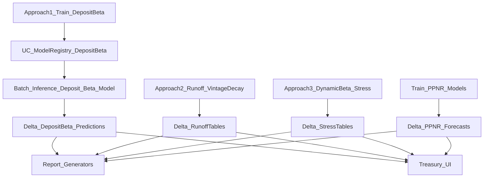

# Treasury Modeling with Databricks (Umbrella)

## Objective
Re-organize this demo under a single umbrella: **Treasury Modeling with Databricks**, focused on:

- **Deposit Modeling**: deposit beta + runoff/vintage + stress testing
- **PPNR / Fee Income Modeling**: fee income + expense forecasts used in stress testing / planning

## Guardrails (non-negotiable)
- **Do not use “Phase” language** in any user-facing surfaces. Use **Approach 1/2/3** for deposit modeling.
- **No investment portfolio** content anywhere in the demo surfaces.
- We **must not imply maturity sequencing** (no “weeks 1–4” roadmaps). Banks can be large/small and still be at any approach.

## Recommended framing (talk track)
### Deposit Modeling: 3 Approaches (not maturity phases)
- **Approach 1 (Enhanced Static Beta)**: “Best for operational sensitivity and segmentation.”
- **Approach 2 (Vintage + Decay Runoff Forecasting)**: “Best for runoff forecasting and liquidity planning.”
- **Approach 3 (Dynamic Beta + Stress Testing)**: “Best for regulatory stress testing and scenario analysis.”

### PPNR / Fee Income Modeling
- **Fee income forecasting** (non-interest income) + **expense forecasting** → PPNR projections.
- Position it as **Treasury impact**: deposit runoff and rate strategy affects NII and fee income.

## Canonical data flow (source of truth)
> This diagram is the acceptance baseline for wiring notebooks → tables → reports → UI.

## Naming conventions (to enforce)
- **Notebook names**: `Approach1_*`, `Approach2_*`, `Approach3_*`
- **UI labels**: “Approach 1/2/3” (never “Phase”)
- **Model registry**: choose **one canonical deposit beta model name** and use it everywhere (see `docs/workstreams/03_unify_deposit_model_registry_and_batch_inference.md`).

## Acceptance criteria (umbrella)
- Repo-wide search for user-facing “Phase 1/2/3” returns **0** matches (except git history).
- Repo-wide search for investment-portfolio terminology returns **0** matches in UI/backend/notebooks/docs.
- UI contains: Deposit Approaches 1–3 + PPNR/Fee Income view.

